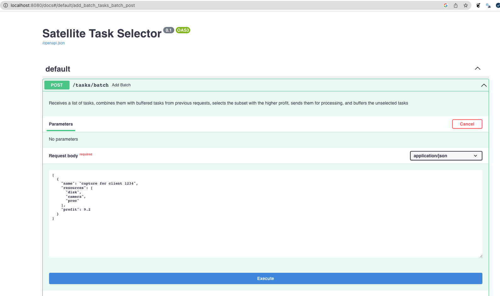

# Satellite Task Selector
An API to manage Satellite Tasks.

## Introduction

This application receives a list of tasks to process and selects the combination that maximizes 
the profit generated, while buffering not selected tasks for future iterations.

It is developed using the [FastAPI](https://fastapi.tiangolo.com/) framework, with [Redis](https://redis.io/docs) as an in-memory buffer. 
Dependency management is done using [Poetry](https://python-poetry.org/).

The repository also contains a dockerized infrastructure for logging with the [ELK Stack](https://www.elastic.co/es/what-is/elk-stack) and 
metrics monitoring using [Prometheus+Grafana](https://grafana.com/oss/prometheus/).

Code quality checks are implemented using the [pre-commit](https://pre-commit.com/) framework, currently it runs git hooks for the following libraries:

- [Flake8](https://flake8.pycqa.org/)
- [Pylint](https://pylint.pycqa.org/)
- [MyPy](https://mypy.readthedocs.io/en/stable/) 
- [Black](https://github.com/psf/black)

## Running the application
### From source

1. Install Poetry in your system

```bash
   $ curl -sSL https://raw.githubusercontent.com/python-poetry/poetry/master/get-poetry.py | python -
```

2. Install dependencies

```bash
   $ poetry install 
```

3. Activate Poetry venv

```bash
   $ poetry shell 
```

4. Check Redis is up and running, and accesible to the API.

```bash
   $ docker run -d -p 6379:6379 redis
```

5. Run the application. This will run only the API, with no infrastructure component, so you have to make sure Redis is up and running and accesible to the API.

```bash
   $ uvicorn app.main:app --host 0.0.0.0 --port 8080
```


### Using Docker Compose


1. Building the images (optional, built automatically with second step if it"s the first time it is executed)

```bash
   $ docker-compose build api
   $ docker-compose build filebeat
```

2. Starting up the system 

```bash
   $ docker-compose up 
```


## Using the Application

Satellite Task Selector is REST API, so access is through HTTP calls. If started following the instructions given in the previous section, it can be accessed through localhost in your computer, the main endpoint is:

http://localhost:8080/tasks/batch


### OpenAPI docs
The system provides OpenAPI documentation about all endpoints here:

http://localhost:8080/docs




### Definition of Task

- Every task has the following schema:

```json
{
    "name": string,
    "resources": list of strings,
    "profit": float
}
```

- An example of a task list
```json

[
    {"name": "capture for client 1098", "resources": ["camera", "disk", "proc"] ,
    "profit": 9.2},
    {"name": "clean satellite disk", "resources": ["disk"] , "profit": 0.4},
    {"name": "upgrade to v2.1", "resources": ["proc"] , "profit": 2.9}
]

```


Where tasks names are not empty, resources may be an empty list and profit is non-negative.

#### Restrictions:
- If two tasks require the same resource, then they are incompatible. For example, tasks
“capture for client 1098” and “clean disk” are incompatible.
- If two tasks are incompatible, then you cannot do both in one iteration.

### Sending a task list

Using curl:

```bash
$ curl -X 'POST' \
  'http://localhost:8080/tasks/batch' \
  -H 'accept: application/json' \
  -H 'Content-Type: application/json' \
  -d '[
  {
    "name": "capture for client 1234",
    "resources": [
      "disk",
      "camera",
      "proc"
    ],
    "profit": 9.2
  }
]'
```

The response will look like this:

```json
{
  "selected_tasks": [
    {
      "name": "capture for client 1234",
      "resources": [
        "disk",
        "camera"
      ],
      "profit": 9.2,
      "buffered": false
    },
    {
      "name": "check proc",
      "resources": [
        "proc"
      ],
      "profit": 3,
      "buffered": true
    }
  ],
  "buffered_tasks": [
    {
      "name": "clean satellite disk",
      "resources": [
        "disk"
      ],
      "profit": 1.2,
      "buffered": true
    },
    {
      "name": "test task",
      "resources": [
        "proc"
      ],
      "profit": 2.1,
      "buffered": true
    }
  ],
  "profit": 12.2
}
```

Where:
- selected_tasks: are the tasks sent for execution 
- buffered_tasks: are the tasks that were save to the buffer for future evaluation
- If a selected task has "buffered: true" it means that it was loaded from buffer, reevaluated and sent for execution during the processing of this request.


### Logging 
Logs are published to docker standard output, if using the ELK infrastructure, logging can be accessed through Kibana here: http://localhost:5601/

### Metrics
Metrics are published to Grafana here: http://localhost:3000/ 